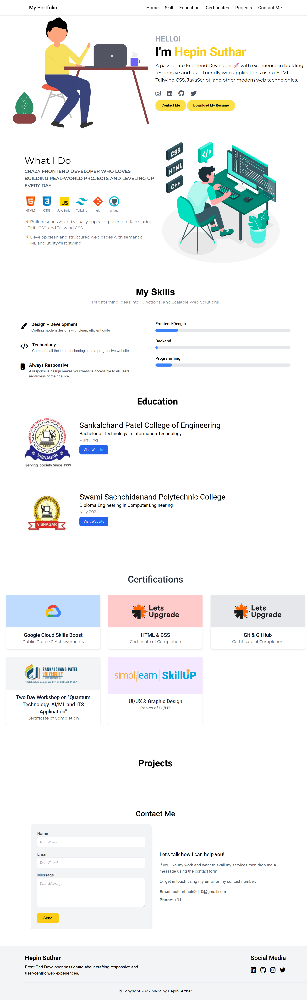

# 🎨 Portfolio Website – Hepin Suthar

Welcome to my personal portfolio! This website showcases my skills, projects, education, and certifications as a **B.Tech Information Technology** student with a strong passion for **web development**.



## 🚀 Live Demo

👉 [Visit My Portfolio](https://hepinsuthar.github.io/Portfolio/)

---

## 📌 Features

- 🎨 **Modern UI**: Built with **HTML**, **CSS**, and **Tailwind CSS** for a clean and responsive interface.
- 💼 **Projects Showcase**: Highlights my work with live links and source code access.
- 📜 **Resume Download**: Visitors can download my resume directly.
- 📬 **Contact Form**: Simple contact form using **FormSubmit**.
- 📱 **Responsive Design**: Fully responsive layout for all devices.
- 🌐 **Social Media Integration**: Linked profiles for connection.
- 🎥 **AOS Animations**: Smooth scroll-based animations using Animate On Scroll.
- 🚀 **Optimized for SEO and Performance**

---

## 🛠️ Tech Stack

- **Frontend**: HTML, Tailwind CSS, JavaScript  
- **Libraries**: AOS (Animate On Scroll), Font Awesome  
- **Form Handling**: FormSubmit  
- **Hosting**: GitHub Pages  

---

## 🗂️ Project Structure

```
/portfolio
├── index.html               # Main HTML file
├── style.css                # Custom styling
├── script.js                # Interactivity & form handling
├── README.md                # Project documentation
├── images/                  # Image assets
│   ├── about.jpg
│   ├── hello.svg
│   ├── 52355.jpg
│   ├── sankalchand_patel_college_of_engineering_spce_visnagar_logo.jpg
│   └── SSPC.PNG
```

---

## 🚀 Deployment

- **GitHub Pages**: Push changes and enable GitHub Pages.

---

## 📧 Contact

If you'd like to collaborate, hire, or just say hello:

- 📬 **Email**: [sutharhepin2610@gmail.com](mailto:sutharhepin2610@gmail.com)
- 💼 [LinkedIn](https://www.linkedin.com/in/hepin-suthar-ab2446301)
- 🐙 [GitHub](https://github.com/HepinSuthar)
- 🐦 [Twitter](https://x.com/HepinSuthar)
- 📷 [Instagram](https://www.instagram.com/hepin_suthar.26)

---

> Made with ❤️ by **Hepin Suthar**
